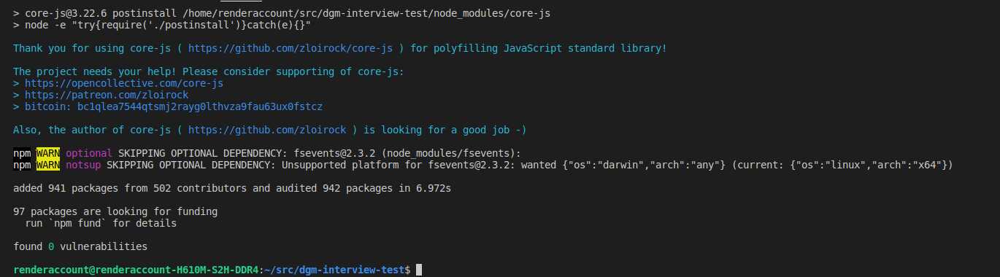

# DIGIME Interview Test Cases

This repo contains the source code Digime interview test cases.

Digime homepage: https://digime.asia


# Prerequisites

1. Git: See [git installation guides](https://github.com/git-guides/install-git)
2. NodeJS: any 12.x version starting with 12.0.0 or greater than ([NodeJS setup guide](https://nodejs.org/en/download/))
3. NPM: Require npm version 5.x or greater
4. VueCLI: Require Vue CLI 4.x version ([Vue CLI installation guide](https://cli.vuejs.org/guide/installation.html))
5. A clone of this project in your machine


# Getting started

## Project installation

### Install all related packages by run this command

```
npm install
```

Packages were installed successfully if the terminal is showing:


### Compiles and hot-reloads for development
```
npm run serve
```

### Compiles and minifies for production
```
npm run build
```

### Lints and fixes files
```
npm run lint
```

# Author

Ngo Huu Van